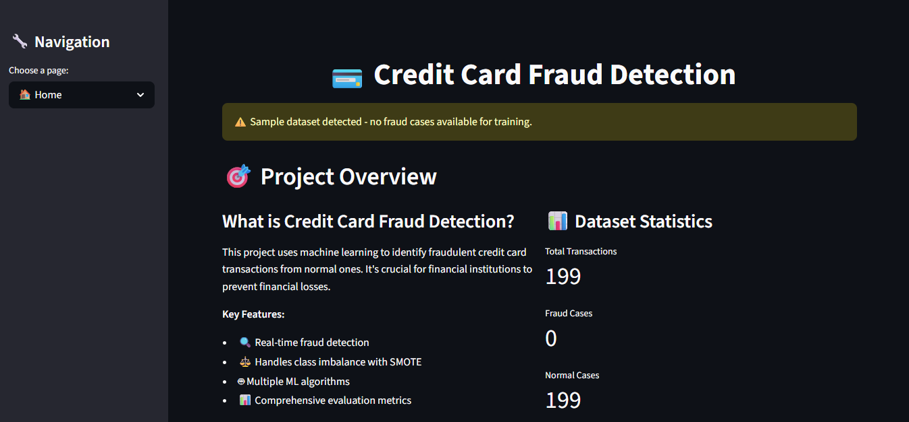
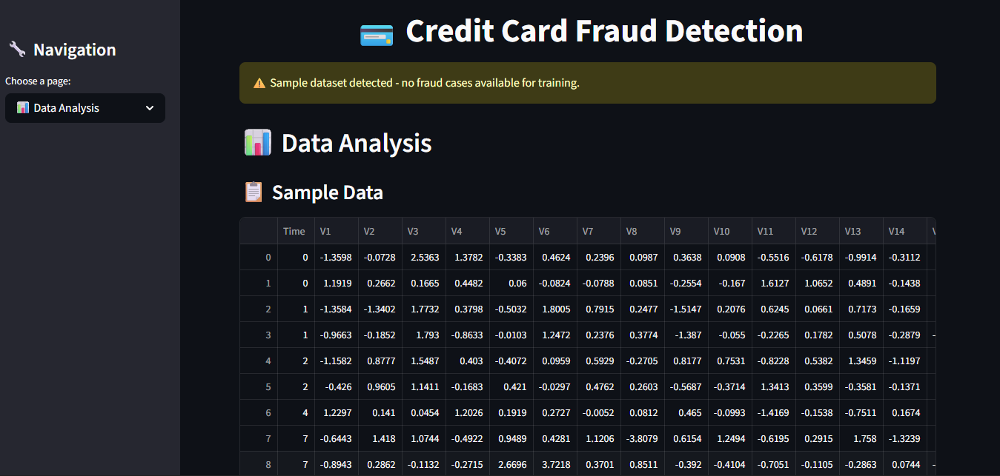
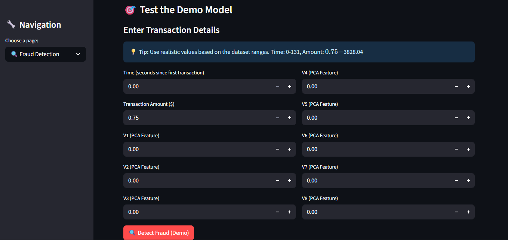
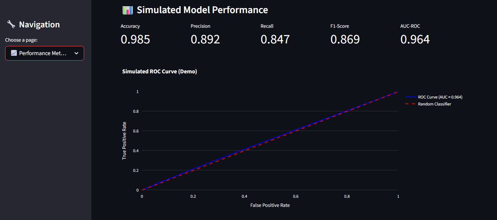

# Credit Card Fraud Detection using Machine Learning

A comprehensive machine learning project that implements multiple algorithms to detect fraudulent credit card transactions. This project demonstrates advanced data preprocessing techniques, handling of imbalanced datasets, and thorough model evaluation.

## ⚠️ Important Note About the Dataset

**The current `creditcard.csv` file is a SAMPLE dataset containing only normal transactions (199 records).**

For meaningful fraud detection results, you need the complete dataset with both normal and fraudulent transactions. The full dataset contains:
- **284,807 total transactions**
- **492 fraudulent transactions (0.172%)**
- **284,315 normal transactions (99.828%)**

### How to Get the Full Dataset

1. **Download from Kaggle**: Visit [Credit Card Fraud Detection Dataset](https://www.kaggle.com/datasets/mlg-ulb/creditcardfraud)
2. **Replace the file**: Download the full `creditcard.csv` and replace the current sample file
3. **Run the script**: The code will automatically detect the full dataset and run the complete analysis

## Project Overview

The project analyzes credit card transaction data to identify fraudulent transactions. It uses:
- **SMOTE (Synthetic Minority Over-sampling Technique)** to handle class imbalance
- **Multiple ML algorithms** for comparison
- **ROC curves** and performance metrics for evaluation

## Screenshots

### 🏠 Home Page

*Project overview with dataset statistics and key features*

### 📊 Data Analysis Page

*Interactive data exploration with sample transaction data*

### 🔍 Fraud Detection Demo

*Interactive fraud detection interface with transaction input fields*

### 📈 Performance Metrics

*Model performance visualization with ROC curves and evaluation metrics*

**Note**: The screenshots show the application running in demo mode with the sample dataset. With the full dataset, you'll see real model training and actual fraud detection capabilities.

## Files in the Project

- `CreditCardFraud.py` - Main Python script with all the machine learning code
- `creditcard.csv` - **SAMPLE** dataset (replace with full dataset for real analysis)
- `requirements.txt` - Python dependencies
- `README.md` - This file with setup instructions
- `streamlit_app.py` - Streamlit web app for interactive demo and analysis
- `streamlit_requirements.txt` - Dependencies for running the Streamlit app
- `deployment_guide.md` - Detailed guide with multiple deployment options

## Prerequisites

- Python 3.7 or higher
- pip (Python package installer)

## Installation and Setup

### Step 1: Install Python Dependencies

Open your terminal/command prompt and run:

```bash
pip install -r requirements.txt
```

Or install packages individually:

```bash
pip install pandas numpy scikit-learn imbalanced-learn matplotlib
```

If you want to run the Streamlit web app, install these instead (or in addition):

```bash
pip install -r streamlit_requirements.txt
```

### Step 2: Get the Full Dataset (Recommended)

1. Download the full dataset from [Kaggle](https://www.kaggle.com/datasets/mlg-ulb/creditcardfraud)
2. Replace the current `creditcard.csv` file with the downloaded file
3. The script will automatically detect the full dataset and run complete analysis

### Step 3: Run the Project

Execute the Python script:

```bash
python CreditCardFraud.py
```

### Step 4: Run the Streamlit Web App (Live Demo)

```bash
streamlit run streamlit_app.py
```

Then open the URL shown in the terminal (e.g., `http://localhost:8501`).

Notes:
- With the sample dataset (no fraud cases), the app automatically switches to a safe demo mode for training, prediction, and metrics.
- When you replace `creditcard.csv` with the full dataset, the app will train and evaluate a real model.

## What the Script Does

### With Sample Dataset (Current):
- Shows data structure and preprocessing steps
- Demonstrates the pipeline without running ML algorithms
- Provides information about getting the full dataset

### What the Streamlit App Provides
- Interactive pages: Home, Data Analysis, Model Training, Fraud Detection, Performance Metrics
- Works with the sample dataset (demo mode) and full dataset (real training/prediction)
- Visualizations with Plotly and clear, guided UI

### With Full Dataset:
1. **Data Loading**: Loads the credit card transaction dataset
2. **Data Preprocessing**: 
   - Separates features and target variable
   - Splits data into training and test sets (75:25)
   - Applies SMOTE to balance the dataset
3. **Model Training**: Trains four different models:
   - Logistic Regression
   - K-Nearest Neighbors (K=5)
   - Random Forest (Gini criterion)
   - Random Forest (Entropy criterion)
4. **Evaluation**: For each model, calculates:
   - Confusion Matrix
   - Accuracy, Precision, Recall
   - AUC-ROC score
   - Plots ROC curves

## Expected Output

### Current (Sample Dataset):
- Dataset statistics and structure
- Information about getting the full dataset
- Demonstration of preprocessing steps

### With Full Dataset:
- Dataset statistics
- Performance metrics for each model
- ROC curve plots for visual comparison

## Troubleshooting

### Common Issues:

1. **FileNotFoundError**: Make sure `creditcard.csv` is in the same directory
2. **ImportError**: Install missing packages using `pip install package_name`
3. **MemoryError**: The full dataset is large; ensure you have sufficient RAM
4. **Single-class data error**: This happens with the sample dataset - get the full dataset

5. **Plotly pie chart error (length mismatch)**: The Streamlit app handles single-class datasets automatically. If you modified the app and see this error, ensure the pie chart only uses labels that match available classes.
6. **Time variable conflict**: If you add code that defines a `time` variable, avoid shadowing the `time` module (use `time_val` instead).

### If you get SMOTE-related errors:
```bash
pip install --upgrade imbalanced-learn
```

## Model Performance (Expected with Full Dataset)

The script will show you which model performs best for fraud detection. Typically:
- **Random Forest** often performs well on this type of data
- **AUC-ROC** scores above 0.9 indicate good performance
- **Precision and Recall** help understand the trade-off between false positives and false negatives

## Dataset Information

The full `creditcard.csv` dataset contains:
- **284,807 transactions**
- **492 fraudulent transactions (0.172% of total)**
- **28 features (V1-V28) + Amount + Class**
- Features V1-V28 are PCA-transformed for privacy
- Time: seconds elapsed between each transaction and the first transaction
- Amount: transaction amount

## Contributing

Feel free to modify the code to:
- Try different algorithms
- Adjust hyperparameters
- Add new evaluation metrics
- Implement cross-validation
- Add feature engineering
- Implement ensemble methods

## Quick Start for Real Analysis

1. **Download full dataset**: [Kaggle Credit Card Fraud Dataset](https://www.kaggle.com/datasets/mlg-ulb/creditcardfraud)
2. **Replace sample file**: Put the full `creditcard.csv` in this directory
3. **Install dependencies**: `pip install -r requirements.txt`
4. **Run analysis**: `python CreditCardFraud.py`
5. **View results**: Check the console output and generated plots

## Deploying the Project

For a complete deployment playbook (Streamlit Cloud, Heroku, Docker, AWS), see `deployment_guide.md`.

Quick deploy (Streamlit Cloud):
1. Push your code to GitHub
2. Go to the Streamlit Cloud dashboard (`https://share.streamlit.io`)
3. Connect your repo and select `streamlit_app.py`
4. Set Python version and install from `streamlit_requirements.txt`
5. Deploy

## License

This project is licensed under the MIT License - see the [LICENSE](LICENSE) file for details.